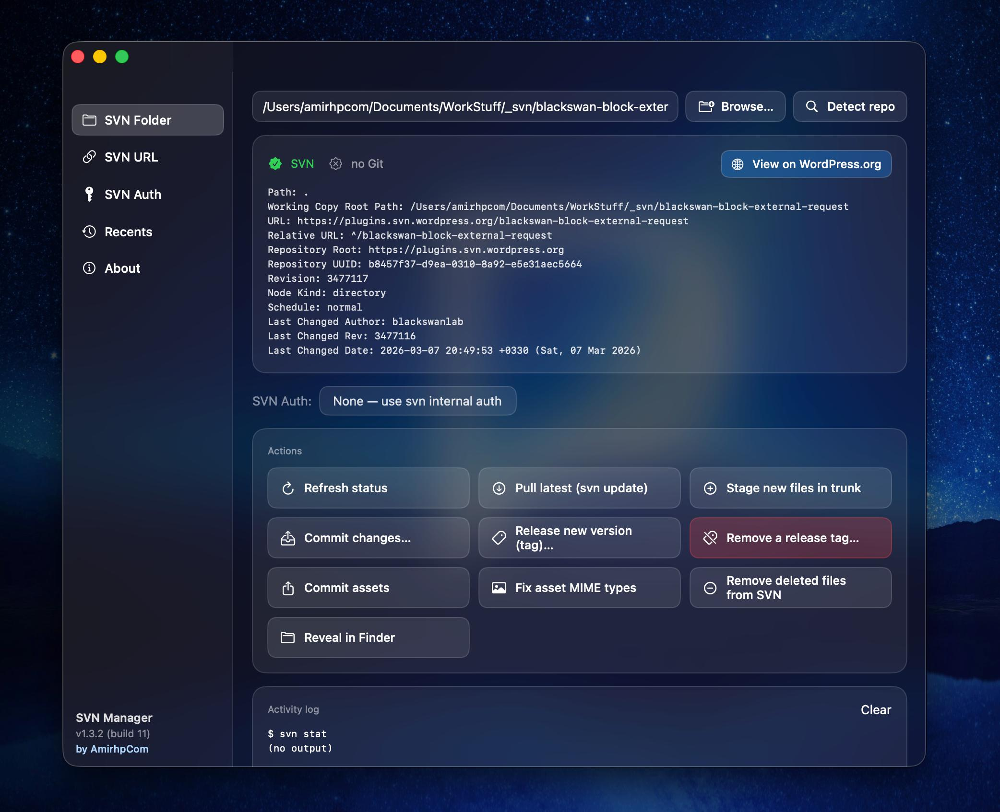

# SVN Manager

[](https://github.com/amirhp-com/svn-manager/releases/latest)
[](https://github.com/amirhp-com/svn-manager/releases)
[](https://github.com/amirhp-com/svn-manager)
[](https://swift.org)
[](https://github.com/amirhp-com/svn-manager/stargazers)

A lightweight, native macOS app for the WordPress.org plugin SVN workflow. Single window, dark mode, Apple liquid-glass vibrancy. Wraps the SVN/Git commands you run every release into one-click buttons with saved auth profiles, a transparent activity log, and a recent-folders list.

<p align="center">
  
</p>

## Download

➡️ **[Download the latest release](https://github.com/amirhp-com/svn-manager/releases/latest)** — drag `SVN Manager.app` from the DMG into your `/Applications` folder.

Or build it yourself from source (see below).

## Features

- **SVN Folder tab** — pick a working copy, see SVN/Git status, and run common actions with one click:
  - Refresh status, Pull latest, Stage new files in trunk, Commit changes
  - Release new version (tag), Remove a release tag
  - Commit assets, Fix asset MIME types
  - Remove deleted files from SVN (the `! → svn rm → commit` cleanup)
  - Reveal in Finder
  - Git status, Git pull, Git commit & push (when a `.git` is present)
  - Auto-detects WordPress.org plugin URLs and shows a "View on WordPress.org" link
- **SVN URL tab** — paste a repo URL and a local folder, choose SVN/Git/Auto, and click **Checkout / Fetch latest**. Re-running on an existing working copy updates instead of re-cloning.
- **SVN Auth tab** — saved credential profiles. Each profile has a name, username, password, optional folder scope (applies only to that folder and its subfolders), and an optional default flag. The Folder tab auto-selects the matching default and lets you switch to *None — use svn internal auth* at any time.
- **Recents tab** — every folder you inspect is added to a recent-list (capped at 30). Double-click a row or use the arrow button to load it back into the Folder tab. Reveal in Finder, remove individual entries, clear all, or disable history recording entirely.
- **About tab** — version, copyright, links, disclaimer, and a selectable cheat sheet of the SVN/Git commands this app wraps.
- **Activity log** — every button shows the exact `svn` / `git` command before running it, then the output, so nothing is hidden. Tooltips on every button explain what they do.

## Build & run from source

Requires Xcode 15+ / Swift 5.9+ / macOS 14+. Needs `svn` and `git` on your `PATH`.

```bash
swift run                # quick dev run
./build.sh               # produces a real .app bundle + DMG installer
open "build/SVN Manager.app"
```

`build.sh` will:
1. Render the app icon into `build/AppIcon.icns`
2. Build a release binary
3. Assemble `build/SVN Manager.app` with a proper `Info.plist`
4. Package `build/SVN-Manager-1.3.3.dmg` containing the app and an `Applications` symlink for drag-install

## Auth storage

Profiles are saved as JSON at `~/Library/Application Support/SVNManager/auth.json`. For production hardening, swap `AuthStore` to read/write the macOS Keychain — the rest of the app uses only `profiles` and `candidates(for:)` and won't need to change.

## Disclaimer

This application is provided **"as is"**, without warranty of any kind, express or implied, including but not limited to merchantability, fitness for a particular purpose, and non-infringement. It runs the system `svn` and `git` command-line tools on your behalf. **You are solely responsible** for the credentials you store and for any commits, tags, or deletions you trigger from the UI. Always review the activity log before performing destructive operations on remote repositories. The author accepts no liability for data loss, broken releases, or any other damages arising from use of this software.

## Links

- Website: <https://amirhp.com/landing>
- Source: <https://github.com/amirhp-com/svn-manager>
- Releases: <https://github.com/amirhp-com/svn-manager/releases>

## License

© 2026- amirhp.com — All rights reserved.
