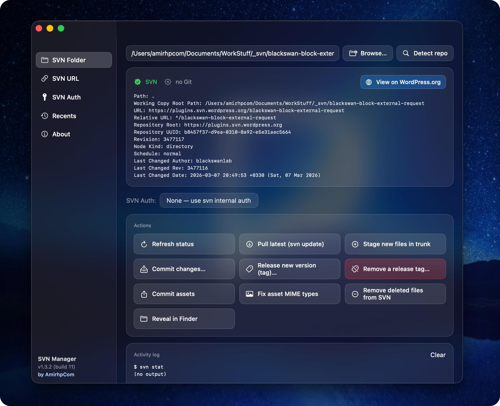

# SVN Manager

A lightweight, native macOS app for the WordPress.org plugin SVN workflow. Single window, dark mode, Apple liquid-glass vibrancy. Wraps the SVN/Git commands you run every release into one-click buttons with saved auth profiles and a transparent activity log.



## Features

- **SVN Folder tab** — pick a working copy, see SVN/Git status, and run common actions with one click:
  - Refresh status, Pull latest, Stage new files in trunk, Commit changes
  - Release new version (tag), Remove a release tag
  - Fix asset MIME types (the `assets/*.png|jpg|jpeg|gif|svg` propset → commit dance)
  - Remove deleted files from SVN (the `! → svn rm → commit` cleanup)
  - Reveal in Finder, Git status / Git pull when a `.git` is present
- **SVN URL tab** — paste a repo URL and a local folder, choose SVN/Git/Auto, and click **Checkout / Fetch latest**. Re-running on an existing working copy updates instead of re-cloning.
- **SVN Auth tab** — saved credential profiles. Each profile has a name, username, password, optional folder scope (applies only to that folder and its subfolders), and an optional default flag. The Folder tab auto-selects the matching default and lets you switch to *None — use svn internal auth* at any time.
- **About tab** — version, build, copyright, links, disclaimer.
- **Activity log** — every button shows the exact `svn` / `git` command before running it, then the output, so nothing is hidden. Tooltips on every button explain what it does and which command(s) it will run.

## Build & run from source

Requires Xcode 15+ / Swift 5.9+ / macOS 13+. Needs `svn` and `git` on your `PATH`.

```bash
swift run                # quick dev run
./build.sh               # produces a real .app bundle + DMG installer
open "build/SVN Manager.app"
```

`build.sh` will:
1. Render an app icon into `build/AppIcon.icns`
2. Build a release binary
3. Assemble `build/SVN Manager.app` with a proper `Info.plist`
4. Package `build/SVN-Manager-1.2.0.dmg` containing the app and an `Applications` symlink for drag-install

## Install

Open `build/SVN-Manager-1.2.0.dmg` and drag **SVN Manager** into **Applications**.

## Auth storage

Profiles are saved as JSON at `~/Library/Application Support/SVNManager/auth.json`. For production hardening, swap `AuthStore` to read/write the macOS Keychain — the rest of the app uses only `profiles` and `candidates(for:)` and won't need to change.

## Disclaimer

This application is provided "as is", without warranty of any kind, express or implied, including but not limited to merchantability, fitness for a particular purpose, and non-infringement. It runs the system `svn` and `git` command-line tools on your behalf. You are solely responsible for the credentials you store and for any commits, tags, or deletions you trigger from the UI. Always review the activity log before performing destructive operations on remote repositories. The author accepts no liability for data loss, broken releases, or any other damages arising from use of this software.

## Links

- Website: <https://amirhp.com/landing>
- Source: <https://github.com/amirhp-com/svn-manager>

## License

© 2026- amirhp.com — All rights reserved.
